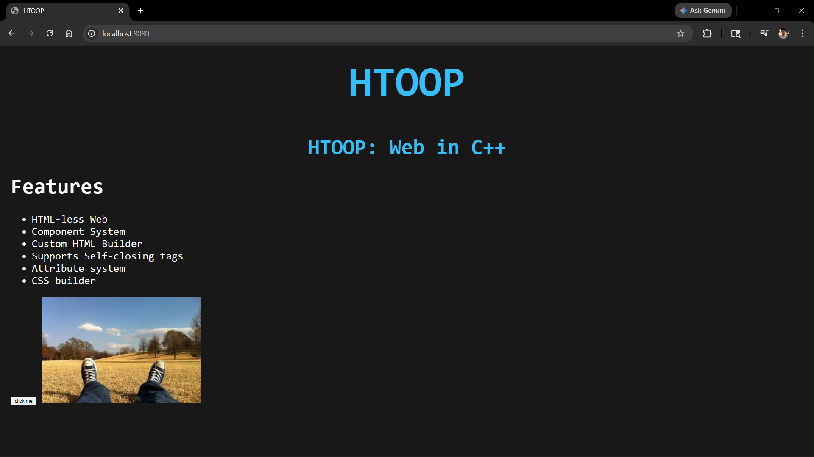
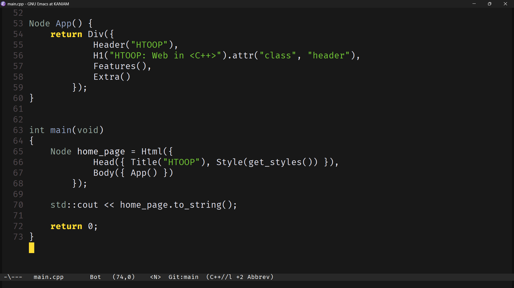

# htoop
Compile your html!!
C++ <3 HTML

## Build
- windows 
```bash
g++ -o demo demo.cpp -lws2_32
.\demo.exe

```
- linux 
```bash
g++ -o demo demo.cpp 
./demo

```
## Demo


## Snippet


# TODO:
- [x] implement attributes
- [x] implement other tags
- [ ] improve the architechture
- [x] implement the server (Used lib)
- [x] remove the intermediate step (html less)
- [ ] implement Node find/find_by_id/find_by_class
- [ ] implement conditional rendering append_if
- [ ] variable interpolation: replace {{key}} with value
- [ ] form element implement
