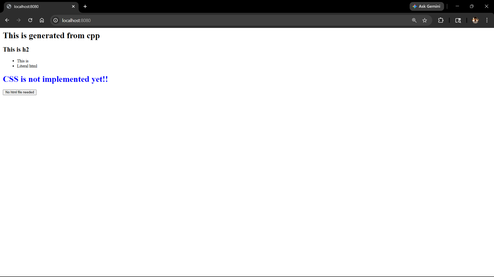

# htoop
Compile your html!!
C++ <3 HTML

## Build
- windows 
```bash
g++ -o html html.cpp -lws2_32
.\html.exe

```
- linux 
```bash
g++ -o html html.cpp 
./html

```
## Demo


# TODO:
- [ ] implement attributes
- [ ] implement other tags
- [ ] improve the architechture
- [x] implement the server (Used lib)
- [x] remove the intermediate step (html less)
